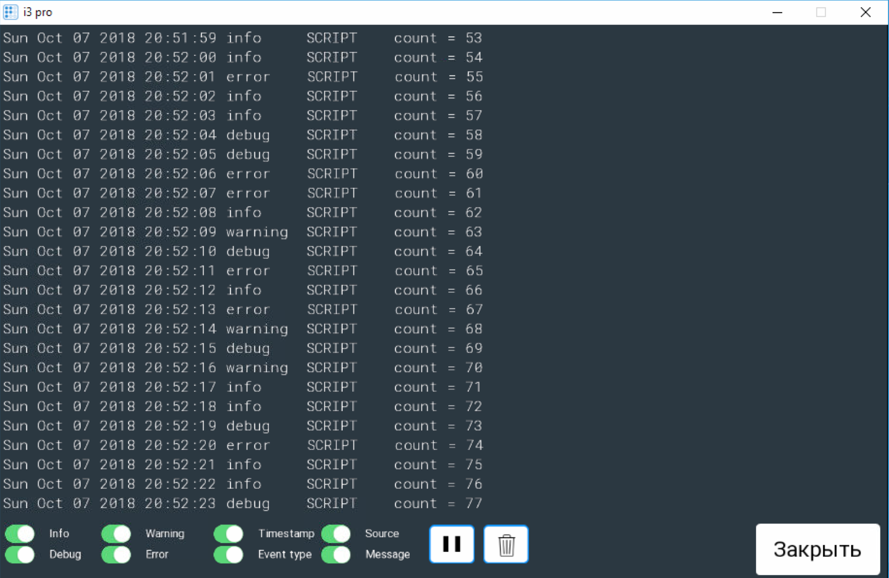

# DebugConsole для панельных проектов в iRidium mobile

Модуль предназначен для вывода отладочной информации в панельных проектах [iRidium mobile](http://www.iridi.com)



Модуль может использоваться сам по себе или вместе с модулем [SyslogServer](https://github.com/bladerunner2020/iridium-syslog).

## Установка и настройка

1. Добавьте модуль в проект

 Если используется grunt-скрипт [Irdiium Project Builder](https://github.com/bladerunner2020/iridium-project-builder)
 для автоматического построения проектов, то для установки модуля нужно использовать команду:

 ```npm
 npm install https://github.com/bladerunner2020/debug-console.git --save
 ```

 В противном случае просто скопируйте код из **index.js** в ваш irpz-проект.

2. Создайте в панельном проекте всплывающую-страницу (popup) или обыкновенную страницу. На странице размещаются
 следующие элементы:

  - **Log** - **Multistate button** с одним состоянием (перенос по словам должен быть выключен).
  Используется для вывода информации. Рекомендуется использовать моноширинные шрифты (*Courier*, *Consoles*, *Roboto mono*
  и др.)
  - **GoBack** - **Button** - закрывает отладочную панель.
  - **ShowInfo** - **Trigger button** - показывает/скрывает информационные сообщения (**info**)
  - **ShowDebug** - **Trigger button** - показывает/скрывает отладочные сообщения (**debug**)
  - **ShowError** - **Trigger button** - показывает/скрывает сообщения об ошибках (**error**)
  - **ShowWarning** - **Trigger button** - показывает/скрывает информационные с предупреждениями (**warning**)
  - **ShowTimestamp** - **Trigger button** - показывает/скрывает колонку с датой и временем
  - **ShowTimestamp** - **Trigger button** - показывает/скрывает колонку с датой и временем
  - **ShowEvent** - **Trigger button** - показывает/скрывает колонку с типом сообщения
  - **ShowSource** - **Trigger button** - показывает/скрывает колонку с источником
  - **ShowMessage** - **Trigger button** - показывает/скрывает колонку с телом сообщения
  - **PlayPause** - **Trigger button** - приостанавливает выдачу сообщений в панель отладки
  - **Clear** - **Trigger button** - очищает буфер сообщений

 Все элементы необязательные.

3. Добавьте в проект возможность отобразить панель при помощи функции **showConsole** или стандартными способами -
показать всплывающую страницу.

4. Добавить в скрипт инициализацию модуля.


## Использование

**Создание отладочной панели**

```javascript
var debugConsole = new DebugConsole({
    lineCount: 25,
    maxBufferSize: 1024,
    noConsoleLog: false,
    // defaultPage: 'Main',
    debugPage: 'DebugPopup'});
```
- **lineCount** - количество строк, которые помещаются в элементе **Log**. К сожалению, iRidium не позволяет
определить их количество автоматически. Значение по умолчанию - 25.
- **maxBufferSize** - размер внутреннего буфера для хранения сообщений (используется кольцевой буфер). Значение по
умолчанию - 1024.
- **noConsoleLog** - по умолчанию сообщения дублируются в **IR.Log**, установите флаг в *true*, если дублирование нужно
отключить. Например, это необходимо сделать при использовании **SyslogServer**. Значение по умолчанию - false.
- **defaultPage** - если в проекте используется не всплывающая страница, а обычная, то при нажатии на кнопку **GoBack**
 откроется последняя страница, если ее определить не удается, то откроется **defaultPage**.
- **debugPage** - имя страницы, на которой отображается отладочная информация (может быть всплывающая или обычная страница)


**Установка начальных значений**
```javascript
debugConsole
    .setEventFilter('debug', true)  // Не показывать события debug
    .showField('source', false);    // Не показывать поле source
```
Типы событий (сообщений): **info**, **debug**, **warning**, **error**. Если в проекте будут другие типы сообщений, то
они всегда будут показываться.

Поля: **timestamp**, **event**, **source**, **message**.

**Вывод информации в отладочную панель**

Для вывода информации в отладочную панель, нужно использовать функцию **log**

```javascript
    debugConsole.log({event: 'debug', message: 'some message', source: 'SCRIPT', timestamp : new Date()});
```
либо:

```javascript
    debugConsole.log('some message');
```
Если в качестве параметра функции **log** используется строка, то тип события может быть задан префиксом:
- **"DEBUG: "** - отладочное сообщение (**debug**)
- **"ERROR: "** - сообщение об ошибке (**error**)
- **"WARNING: "** - сообщение о предупреждении (**warning**)
- Без префикса - информационное сообщение (**info**)

**Функции для замены IR.Log**

Если не используется модуль **SyslogServer**, то удобно сделать собственные функции для вывода отладочной информации.
Например:

```javascript
function _Log(message) {
    debugConsole.log(message);
}

function _Error(message) {
    debugConsole.log('ERROR: ' + message);
}

function _Warning(message) {
    debugConsole.log('WARNING: ' + message);
}
```

Чтобы не определять самостоятельно эти функции, можно воспользоваться модулем **Debug2**.

## Использование DebugConsole вместе с SyslogServer

Пример инициализации **DebugConsole** совместно с **SyslogServer**:

```javascript
var debugConsole = new DebugConsole({
    lineCount: 25,
    maxBufferSize: 1024,
    noConsoleLog: true,
    debugPage: 'DebugPopup'});


new SyslogServer()
    .on('all', function (msg) {
         debugConsole.log(msg);
    });
```


## Пример проекта

В папке **test** находится тестовый проект **debug-console.irpz**, который собирается при помощи grunt-скрипта [Irdiium Project Builder](https://github.com/bladerunner2020/iridium-project-builder).
В папке [test/build]() находится
уже собранный проект - скачивайте и смотрите, как все работает. :smile:

## Идеи для будущего развития

- Добавить возможность листать лог вверх/низ
- Сделать подсветку лога разными цветами в зависимости от типа сообщений (потребуется использования элемента "список")


## Авторы

* Александр Пивоваров aka Bladerunner2020 ([pivovarov@gmail.com](mailto:pivovarov@gmail.com))

## Лицензия
Copyright (c) 2018 Александр Пивоваров

Данная лицензия разрешает лицам, получившим копию данного программного обеспечения и сопутствующей документации (в дальнейшем именуемыми «Программное Обеспечение»), безвозмездно использовать Программное Обеспечение без ограничений, включая неограниченное право на использование, копирование, изменение, слияние, публикацию, распространение, сублицензирование и/или продажу копий Программного Обеспечения, а также лицам, которым предоставляется данное Программное Обеспечение, при соблюдении следующих условий:

Указанное выше уведомление об авторском праве и данные условия должны быть включены во все копии или значимые части данного Программного Обеспечения.

ДАННОЕ ПРОГРАММНОЕ ОБЕСПЕЧЕНИЕ ПРЕДОСТАВЛЯЕТСЯ «КАК ЕСТЬ», БЕЗ КАКИХ-ЛИБО ГАРАНТИЙ, ЯВНО ВЫРАЖЕННЫХ ИЛИ ПОДРАЗУМЕВАЕМЫХ, ВКЛЮЧАЯ ГАРАНТИИ ТОВАРНОЙ ПРИГОДНОСТИ, СООТВЕТСТВИЯ ПО ЕГО КОНКРЕТНОМУ НАЗНАЧЕНИЮ И ОТСУТСТВИЯ НАРУШЕНИЙ, НО НЕ ОГРАНИЧИВАЯСЬ ИМИ. НИ В КАКОМ СЛУЧАЕ АВТОРЫ ИЛИ ПРАВООБЛАДАТЕЛИ НЕ НЕСУТ ОТВЕТСТВЕННОСТИ ПО КАКИМ-ЛИБО ИСКАМ, ЗА УЩЕРБ ИЛИ ПО ИНЫМ ТРЕБОВАНИЯМ, В ТОМ ЧИСЛЕ, ПРИ ДЕЙСТВИИ КОНТРАКТА, ДЕЛИКТЕ ИЛИ ИНОЙ СИТУАЦИИ, ВОЗНИКШИМ ИЗ-ЗА ИСПОЛЬЗОВАНИЯ ПРОГРАММНОГО ОБЕСПЕЧЕНИЯ ИЛИ ИНЫХ ДЕЙСТВИЙ С ПРОГРАММНЫМ ОБЕСПЕЧЕНИЕМ.
